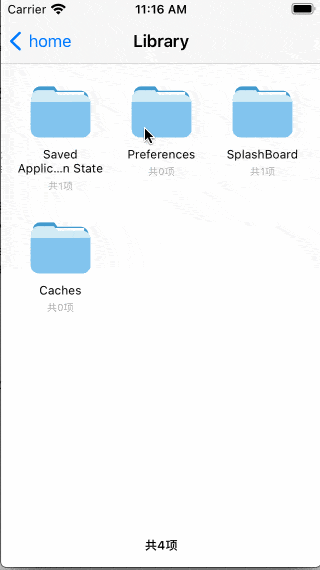

# FileBrowser

[](https://travis-ci.org/yizhaorong/FileBrowser)
[](https://cocoapods.org/pods/FileBrowser)
[](https://cocoapods.org/pods/FileBrowser)
[](https://cocoapods.org/pods/FileBrowser)

## Example



To run the example project, clone the repo, and run `pod install` from the Example directory first.

使用方法

```objective-c
FBFileBrowerViewController *vc = [FBFileBrowerViewController new];
[self.navigationController pushViewController:vc animated:YES];
```


## Requirements

## Installation

FileBrowser is available through [CocoaPods](https://cocoapods.org). To install
it, simply add the following line to your Podfile:

```ruby
pod 'FileBrowser', :git => 'https://github.com/yizhaorong/FileBrowser.git'
```

## Author

yizhaorong, 243653385@qq.com

## License

FileBrowser is available under the MIT license. See the LICENSE file for more info.
